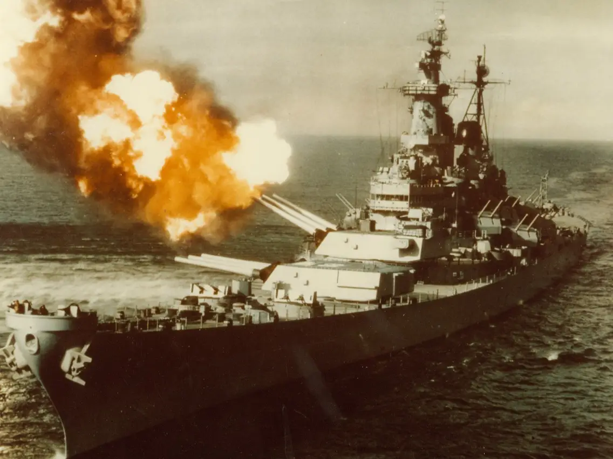

    <h1>USS Watson</h1>
    

Hello! We are team **USS Watson**. The name was made when we saw a road sign that said "Watson" on our drive down to [Hack Midwest](https://hackmidwest.com/). Sadly Watson was taken so we brainstormed and landed on `USS` as a prefix.

## Team Members

- Alex ([curtainman](https://github.com/curtainman/))
- Anton ([anton-3](https://github.com/anton-3/))
- Blaine ([blaine-t](https://github.com/blaine-t/))
- Louis ([WalterOfNone](https://github.com/WalterOfNone/))

## Projects

- LISA (WIP)
